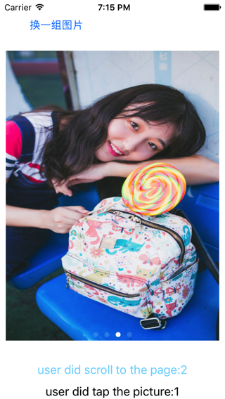

<h2>Table of Contents</h2>

<ul>
<li><a href="#orgheadline1">1. 网络图片下载,用UIScrollView,使用AutoLayout方式布局</a></li>
<li><a href="#orgheadline2">2. Screen shots</a></li>
</ul>

# 网络图片下载,用UIScrollView,使用AutoLayout方式布局

因自己的App需求, 要用到UIScrollView 来show一组网络下载的图片.
看了下网上大家的开源代码,都是用frame 方式把尺寸写死. 感觉没有用Autolayout方式灵活.
便自己实现了个demo, 希望你能喜欢. 请给\*star\*,有问题请\*issues\*. Thanks! 

# Screen shots

